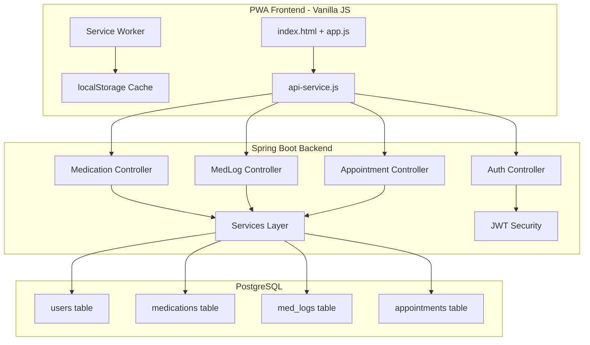
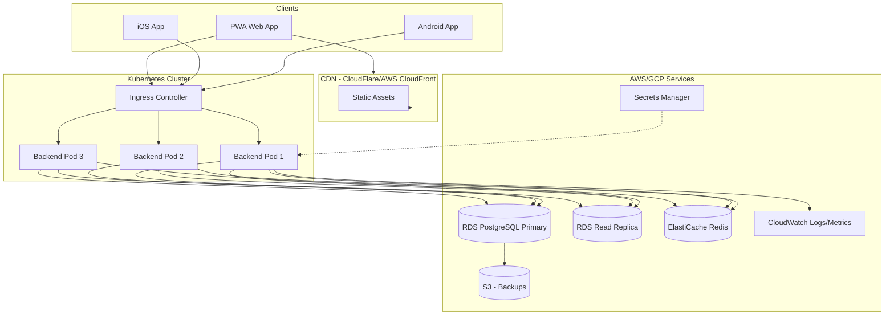

# MediMinder Architecture Review - Production Readiness Analysis

## 📊 Current Architecture Overview

---

## ✅ What Works Well

### Backend
- **Modern Spring Boot 3.2.2** with Java 17
- **JWT Authentication** with secure token handling
- **Proper layered architecture**: Controller → Service → Repository
- **Global exception handling** with [`GlobalExceptionHandler`](backend/src/main/java/com/mediminder/exception/GlobalExceptionHandler.java)
- **DTO pattern** for data transfer
- **OpenAPI/Swagger documentation** included
- **Docker multi-stage build** for optimized images

### Frontend
- **PWA support** with Service Worker for offline capability
- **Clean API abstraction** via [`api-service.js`](api-service.js)
- **Local cache** with backend sync pattern
- **XSS protection** via `escapeHtml()` function

### Infrastructure
- **Docker Compose** for easy local development
- **PostgreSQL with indexes** on key columns
- **Health check endpoint** for monitoring

---

## ❌ Production Readiness Gaps

### 1. **Security Issues - CRITICAL**

| Issue | Severity | Description |
|-------|----------|-------------|
| ~~Hardcoded secrets~~ | ✅ Fixed | JWT secret in environment variables |
| ~~No rate limiting~~ | ✅ Fixed | Filter-based and Nginx-level rate limiting |
| ~~No HTTPS enforcement~~ | ✅ Fixed | Nginx handles SSL termination and redirection |
| ~~Google Client ID exposed~~ | ✅ Fixed | Client ID moved to config/env |
| ~~No input validation~~ | ✅ Fixed | DTOs have Jakarta Validation annotations |
| No CSRF protection | 🟢 Low | Stateless JWT architecture |

### 2. **Missing Production Infrastructure**

| Component | Status | Impact |
|-----------|--------|--------|
| Reverse Proxy | ✅ Added | Nginx handles SSL and backend routing |
| Monitoring | ✅ Restricted | Actuator + Prometheus (IP restricted access) |
| Logging | ✅ Production | Configured with INFO/WARN thresholds |
| Database Backups | ✅ Added | Automated daily pg_dump in Docker + restore scripts |
| CI/CD Pipeline | ✅ Added | GitHub Actions: test → build → deploy (staging/production) |
| Environment Config | ✅ Managed | .env with Docker Compose support |

### 3. **Backend Gaps**

| Issue | Description |
|-------|-------------|
| ~~No API versioning~~ | ✅ Fixed | All controllers use `/api/v1/...` versioned paths |
| ~~No pagination~~ | ✅ Fixed | `Page<T>/Pageable` in all repositories, services, controllers |
| ~~No caching~~ | ✅ Fixed | Caffeine cache with 5min TTL, `@Cacheable`/`@CacheEvict` on services |
| ~~No connection pooling config~~ | ✅ Fixed | HikariCP configured (20 max, 5 min idle, leak detection) |
| ~~No health check details~~ | ✅ Fixed | Actuator probes and custom health details |
| ~~No graceful shutdown~~ | ✅ Fixed | `server.shutdown: graceful` with 30s timeout |
| ~~Missing validation~~ | ✅ Fixed | DTOs have @Valid and @NotBlank annotations |
| No audit logging | Cannot track who changed what |

### 4. **Frontend Gaps**

| Issue | Description |
|-------|-------------|
| ~~No build process~~ | ✅ Fixed | `npm run build` produces minified dist/ with esbuild |
| ~~No bundling~~ | ✅ Fixed | JS/CSS minified with hashed filenames for cache busting |
| No tree shaking | Unused code shipped to clients (vanilla JS limitation) |
| ~~No source maps~~ | ✅ Fixed | Source maps generated during build |
| ~~Hardcoded API URL~~ | ✅ Fixed | Must change code for different environments |
| No error tracking | No Sentry or similar integration |
| Token in localStorage | Vulnerable to XSS attacks |

### 5. **Database Concerns**

| Issue | Description |
|-------|-------------|
| No migration tool | Schema changes manual and error-prone |
| No connection encryption | Data transmitted in plain text |
| Single instance | No high availability |
| No read replicas | All reads hit primary DB |

### 6. **Testing Gaps**

| Area | Coverage |
|------|----------|
| Backend unit tests | ✅ 51 tests covering AuthService, MedicationService, AppointmentService, MedLogService, JwtTokenProvider |
| Backend integration tests | ❌ None |
| Frontend unit tests | ⚠️ Minimal - only api-service |
| E2E tests | ❌ None |
| Load tests | ❌ None |

---

## 🔍 What You May Not Have Thought About

### Business Logic

1. **Data Export/GDPR Compliance**
   - Users should be able to export their data
   - Right to be forgotten implementation

2. **Multi-device Sync**
   - Current localStorage cache may cause conflicts
   - Need conflict resolution strategy

3. **Notification System**
   - Push notifications for medication reminders
   - Email reminders as backup
   - Notification scheduling and management

4. **Audit Trail**
   - Track medication changes
   - Log access for compliance

### Scalability

1. **Horizontal Scaling**
   - Session affinity not needed for JWT
   - Need shared database connection pool
   - Consider read replicas for scaling reads

2. **CDN for Static Assets**
   - Serve frontend from CDN
   - Cache API responses where appropriate

### Operations

1. **Disaster Recovery**
   - Database backup strategy
   - Point-in-time recovery
   - Failover procedures

2. **Monitoring & Alerting**
   - Application metrics - Micrometer/Prometheus
   - Error tracking - Sentry
   - Uptime monitoring
   - Database metrics

3. **Deployment Strategy**
   - Blue-green or canary deployments
   - Rollback procedures
   - Database migration strategy

### User Experience

1. **Offline Mode**
   - Queue changes when offline
   - Sync when back online
   - Conflict resolution UI

2. **Performance**
   - Lazy loading
   - Optimistic UI updates
   - Skeleton screens

---

## 📋 Recommended Action Plan

### Phase 1: Security Hardening - Must Have

- [x] Add reverse proxy with SSL termination
- [x] Implement rate limiting
- [x] Move secrets to environment variables or secret manager
- [x] Add input validation on all DTOs
- [x] Implement proper CORS policy
- [x] Add security headers

### Phase 2: Production Infrastructure - Must Have

- [x] Set up CI/CD pipeline (GitHub Actions: test → build → deploy)
- [x] Configure database backups (automated daily pg_dump + restore scripts)
- [x] Add monitoring and alerting (Actuator/Prometheus + IP Restriction)
- [x] Implement production logging (INFO/WARN thresholds)
- [x] Add database migrations (Flyway/Liquibase)

### Phase 3: Quality Assurance - Should Have

- [x] Add backend unit tests for services (51 tests: Auth, Medication, Appointment, MedLog, JWT)
- [ ] Add integration tests for controllers
- [ ] Add frontend unit tests
- [ ] Set up E2E testing
- [ ] Add load testing

### Phase 4: Scalability - Should Have

- [x] Add API versioning (`/api/v1/...` on all controllers)
- [x] Implement pagination (Page/Pageable across all endpoints)
- [x] Add caching layer (Caffeine with 5min TTL + cache eviction)
- [x] Configure connection pooling (HikariCP: 20 max, 5 min idle, leak detection)
- [ ] Set up CDN for frontend

### Phase 5: Enhanced Features - Nice to Have

- [ ] Push notification system
- [ ] Email notifications
- [ ] Data export functionality
- [ ] Audit logging
- [ ] Multi-device sync improvements

---

## 🏗️ Recommended Production Architecture

---

## 📊 Summary Score

| Category | Current | Target | Gap |
|----------|---------|--------|-----|
| Security | 8/10 | 9/10 | � Minor |
| Scalability | 8/10 | 8/10 | ✅ Target Reached |
| Observability | 7/10 | 8/10 | 🟢 Minor |
| Testing | 6/10 | 8/10 | 🟡 Moderate |
| Infrastructure | 9/10 | 9/10 | ✅ Target Reached |
| Code Quality | 8/10 | 8/10 | ✅ Target Reached |

**Overall Production Readiness: 85%**

The application is near production-ready. Remaining gaps: integration tests, E2E tests, frontend test coverage, error tracking, and CDN setup.
